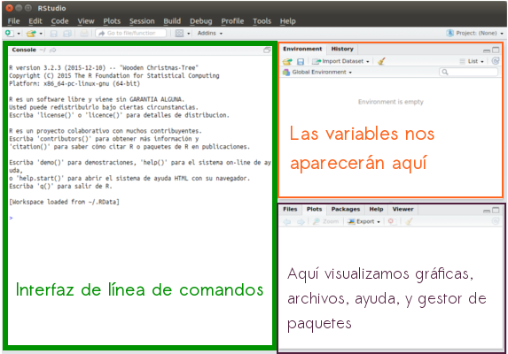
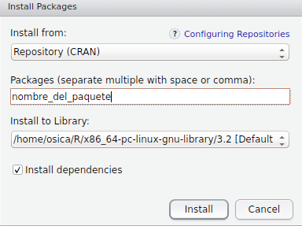
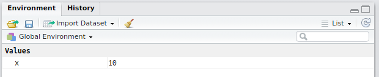

Nivel Basico
================
Geek and Tech Girls
17 de abril de 2017

Tutorial básico sobre R
=======================

Al terminar este tutorial tendrás unas nociones básicas de R y podrás:

-   Instalar paquetes nuevos en R
-   Crear un script de R
-   Hacer operaciones básicas
-   Utilizar distintos tipos de datos simples
-   Crear vectores y vectores-factores
-   Conocer los dataframes de R

R Studio
--------

En este taller utilizaremos R Studio. Consulta el [README](https://github.com/geekandtechgirls/Taller_de_R/blob/master/README.md) para saber más sobre cómo instalarlo. La interfaz de R Studio es así:



Como ves, puedes ir escribiendo los comandos directamente en la línea de comandos, pero también puedes hacer un *script* (un archivo con varios comandos juntos). Para ello nos vamos arriba a la izquierda: .

Además de *scripts*, podemos crear otros tipos de archivos como un *R notebook* o *R markdown*, como los tutoriales del taller.

Para ejecutar las líneas del *script* podemos usar *Run* o hacer *Ctrl+Intro*.

Para añadir comentarios, utiliza la almohadilla: \#.

### Instalando paquetes nuevos

Para instalar paquetes nuevos en R, tenemos dos opciones:

-   Usar el comando

    ``` r
    install.packages('nombre_del_paquete')
    ```

-   Usar el gestor de paquetes (pestaña *Packages -&gt; Install*)



Cuando instalamos un paquete nuevo y lo queremos usar, se lo decimos a R de la siguiente manera:

``` r
require(nombre_del_paquete)
```

    ## Loading required package: nombre_del_paquete

    ## Warning in library(package, lib.loc = lib.loc, character.only = TRUE,
    ## logical.return = TRUE, : there is no package called 'nombre_del_paquete'

### Ejercicio

**Instala el paquete 'ggplot2', muy útil para visualizar datos y hacer gráficas de todo tipo.**

Aritmética con R
----------------

Antes de operar sobre grandes cantidades de datos o usar estructuras de datos complejas, es bueno que nos familiaricemos más con la interfaz de R.

### Asignación de variables

En R podemos trabajar directamente con los datos o guardarlos en variables, para así poder tenerlos disponibles en todo momento y trabajar con ellos. El operador de asignación es **&lt;-**. Por ejemplo:

``` r
x <- 10
```

Si nos fijamos a la derecha, nos aparece la variable creada: 

Y para visualizar variables, lo único que tenemos que hacer es *llamarlas*:

``` r
x
```

    ## [1] 10

Así, podemos ponerle nombre a cualquier operación, además de a funciones. Ten siempre en cuenta que debes usar nombres de variables adecuados para que tu código siempre sea legible.

### Operadores

Los operadores numéricos básicos de R son:

| Operador       | Símbolo  |
|----------------|----------|
| Suma           | +        |
| Resta          | -        |
| Multiplicación | \*       |
| División       | /        |
| Exponente      | ^ ó \*\* |
| Módulo         | %%       |

Por ejemplo:

``` r
1+2
```

    ## [1] 3

O usando variables:

``` r
edad_Nathan <- 6
edad_Fausto <- 5
edad_Kimi <- 1
edad_gatos <- edad_Nathan + edad_Fausto + edad_Kimi
edad_gatos
```

    ## [1] 12

Tipos de datos
--------------

Al igual que todos los lenguajes de programación, *R* trabaja los tipos de datos básicos:

-   **Numeric**: números decimales.
-   **Integer**: números enteros. Para diferenciarlos de los numeric, se coloca una `L` al final de número.
-   **Logical**: valores booleanos. En *R*, los valores booleanos son `TRUE` y `FALSE` aunque también se acepta `T` y `F`.
-   **Character**: texto (*string*).

Para saber el tipo de una variable, se usa la función `class`:

``` r
class(5.6)
```

    ## [1] "numeric"

``` r
class(5L)
```

    ## [1] "integer"

``` r
class(T)
```

    ## [1] "logical"

``` r
class(TRUE)
```

    ## [1] "logical"

``` r
class("TRUE")
```

    ## [1] "character"

### Ejercicio

**Prueba a declarar una variable con un número decimal, pero poniéndole la `L` que se pone al declarar números enteros ¿qué pasa?**

### Ejercicio

**Declara un entero sin la `L` al final y comprueba su tipo, ¿qué tipo de variable es?**

Vectores y factores
-------------------

### Declaración de un vector

En *R*, podemos decir que todo elemento que hagamos, será un vector o *array*, con una longitud determinada, en la que almacenaramos información. Esta información que almacenamos pueden ser datos de tipo *int*, *char*, etc. Un vector lo crearemos con la función *combine* `c()` . En esta función introduciremos los datos que queremos almacenar en nuestro array uno detrás de otro, separados por una coma.

``` r
dado <- c(1, 2, 3, 4, 5, 6)
letras <- c("a", "b", "c", "d", "e", "f")
```

#### Ejercicio

Este año has tenido la suerte de que te has ido a las Vegas y has decidido jugar y apostar en el poker y la ruleta. Durante estos cinco días que llevas de vacaciones tus ingresos y pérdidas han sido:

-   Lunes: has ganado 150$.
-   Martes: has ganado 5$.
-   Miércoles: has perdido 75$.
-   Jueves: has perdido 128$ (vaya racha).
-   Viernes: has ganado 15$.

Y en el caso de la ruleta:

-   Lunes: has perdido 35$.
-   Martes: has ganado 40$.
-   Miércoles: has perdido 165$.
-   Jueves: has ganado 12$ (vaya racha).
-   Viernes: has ganado 178$.

Como tu futuro económico parece incierto, has decido usar tus recientemente adquiridas capacidades en R para analizar estos datos y usar tus habilidades estadísticas para decidir si apostar o no en el futuro. Para ello, empieza introduciendo estos datos en dos vectores.

### Asignar nombres a un vector

Además de crear un vector con datos, en muchos casos, como es en la ciencia de datos, es importante saber qué es cada dato o qué representan los datos de un vector. Esto es muy fácil y cómodo de hacer con la función `names()`. Esta función recibe como argumento nuestro recién y estrenado array y se le asigna un nuevo array que contiene los nombres que queremos asignarle a nuestros datos almacenados. Un ejemplo es el siguiente:

``` r
un_plato <- c("Magdalenas", "Dulce")
elementos <- c("SSD", "Nuevo")

names(un_plato) <- c("Nombre", "Tipo")
names(elementos) <- c("Elemento", "Estado")
```

### Operaciones aritméticas y otras funciones

Al igual que se pueden realizar operaciones aritméticas con variables, esto también es posible realizarlo con nuestros arrays. Hay que tener en cuenta, que estas operaciones se hacen elemento a elemento. Por ejemplo:

``` r
a <- c(1,2,3)
b <- c(4,5,6)

cat("* Suma:", a+b)
```

    ## * Suma: 5 7 9

``` r
cat("* Resta:", a-b)
```

    ## * Resta: -3 -3 -3

``` r
cat("* Multiplicación:", a*b)
```

    ## * Multiplicación: 4 10 18

``` r
cat("* División:", a/b)
```

    ## * División: 0.25 0.4 0.5

Además de esto, R nos ofrece otras funciones ya predefinidas que se encargan de calcular la sumatoria de un vector, como es el caso de la función `sum`, el producto de los elementos de un vector, en este caso es `prod`, la media, para la cual llamaremos a `mean`, etc. Además de funciones como `max` o `min`.

#### Ejercicio

Siguiendo con el estudio para asegurar tu futuro económico, es importante saber en qué día ganaste o perdiste dinero. Para ello, puedes usar la función que acabas de aprender para asignarle a cada valor el día de la semana correspondiente.

Además de esto, es importante saber la pérdida o ganancia total que has tenido cada día, así como la media total de ganancias durante tus vacaciones y lo que has ganado en total a lo largo de la semana. Para ello, utiliza los conocimientos adquiridos y tus habilidades estadísticas, y no olvides mostrar tus datos por pantalla.

Dataframes
----------

Un ***Dataframe*** es una especie de *matriz*, en la que cada columna puede tener un tipo de dato diferente. Es muy parecido a una tabla. Por ejemplo, si queremos guardar datos sobre nuestros compañeros de clase podríamos hacer un *Dataframe*:

``` r
nombre <- c("Paloma", "Cristina", "Ana", "Braulio", "Teresa")
num_favorito <- c(25L, 26L, 27L, 28L, 29L)
dulce_favorito <- c("Cupcake","Pastel","Bizcocho","Bombón","Pastel")
altura <- c(1.70, 1.75, 1.72, 1.80, 1.76)
es_chica <- c(T,T,T,F,T)

amigos <- data.frame(nombre, num_favorito, dulce_favorito, altura, es_chica)
amigos
```

    ##     nombre num_favorito dulce_favorito altura es_chica
    ## 1   Paloma           25        Cupcake   1.70     TRUE
    ## 2 Cristina           26         Pastel   1.75     TRUE
    ## 3      Ana           27       Bizcocho   1.72     TRUE
    ## 4  Braulio           28         Bombón   1.80    FALSE
    ## 5   Teresa           29         Pastel   1.76     TRUE

#### Ejercicio

**Crea tu propio DataFrame sobre la lista de la compra, con los siguientes atributos:**

-   **Nombre del producto**
-   **Precio**
-   **Cantidad a comprar**
-   **¿Lleva aceite de palma?**

**Una vez hayas definido tu Dataframe, expórtalo a un csv con la función `write.csv` y vuélvelo a leer con la función `read.csv`. Para ver la documentación de estas dos funciones escribe `?nombre.de.la.funcion` en el intérprete de R.**

### Vectorizando

Al igual que los vectores o las matrices, en los *Dataframe* también podemos seleccionar elementos usando el operador `[]` y el operador `$`.

Podemos seleccionar toda una columna:

``` r
amigos$nombre
```

    ## [1] Paloma   Cristina Ana      Braulio  Teresa  
    ## Levels: Ana Braulio Cristina Paloma Teresa

``` r
amigos["nombre"]
```

    ##     nombre
    ## 1   Paloma
    ## 2 Cristina
    ## 3      Ana
    ## 4  Braulio
    ## 5   Teresa

El operador `$` devuelve un vector mientras que el `[]` devuelve un *Dataframe* con una única columna.

Podemos seleccionar varias columnas, seleccionandolas con un vector:

``` r
amigos[,c("nombre","altura")]
```

    ##     nombre altura
    ## 1   Paloma   1.70
    ## 2 Cristina   1.75
    ## 3      Ana   1.72
    ## 4  Braulio   1.80
    ## 5   Teresa   1.76

E incluso, podemos seleccionar unas determinadas filas:

``` r
amigos[seq(1,3), c("nombre", "altura")]
```

    ##     nombre altura
    ## 1   Paloma   1.70
    ## 2 Cristina   1.75
    ## 3      Ana   1.72

¿Y si queremos las columnas/filas que **cumplan una determinada condición**? Para ello, tendremos que usar la función `subset`. Por ejemplo, queremos las personas cuyo postre favorito sean los *pasteles*.

``` r
subset(x=amigos, subset=dulce_favorito=="Pastel", select=c(nombre, es_chica))
```

    ##     nombre es_chica
    ## 2 Cristina     TRUE
    ## 5   Teresa     TRUE

### Ejercicio

**Estudia la documentación de `subset` y selecciona aquellos productos de tu lista de la compra que tengan un precio inferior a 5€ y que además no contengan aceite de palma.**

### Añadiendo y eliminando columnas o elementos

Añadir o eliminar columnas a un *Dataframe* es algo fundamental. Nos puede servir, entre otras cosas, para crear columnas que sean una combinación de otras columnas. Para ello se usa la función `cbind`:

``` r
twitters <- c("unintendedbar","_musicalnote", "ana_valdi", "brau_vl", "TessaAlgarra")
cbind(amigos, twitters)
```

    ##     nombre num_favorito dulce_favorito altura es_chica      twitters
    ## 1   Paloma           25        Cupcake   1.70     TRUE unintendedbar
    ## 2 Cristina           26         Pastel   1.75     TRUE  _musicalnote
    ## 3      Ana           27       Bizcocho   1.72     TRUE     ana_valdi
    ## 4  Braulio           28         Bombón   1.80    FALSE       brau_vl
    ## 5   Teresa           29         Pastel   1.76     TRUE  TessaAlgarra

Para eliminar una columna, sólo tenemos que establecerla a `NULL`:

``` r
amigos$num_favorito <- NULL
amigos
```

    ##     nombre dulce_favorito altura es_chica
    ## 1   Paloma        Cupcake   1.70     TRUE
    ## 2 Cristina         Pastel   1.75     TRUE
    ## 3      Ana       Bizcocho   1.72     TRUE
    ## 4  Braulio         Bombón   1.80    FALSE
    ## 5   Teresa         Pastel   1.76     TRUE

Para eliminar una (o varias) fila, lo hacemos usando el operador `-`:

``` r
amigos <- amigos[-c(1,2),]
amigos
```

    ##    nombre dulce_favorito altura es_chica
    ## 3     Ana       Bizcocho   1.72     TRUE
    ## 4 Braulio         Bombón   1.80    FALSE
    ## 5  Teresa         Pastel   1.76     TRUE

#### Ejercicio

**Elimina todos los productos de tu cesta de la compra que contengan aceite de palma.**
