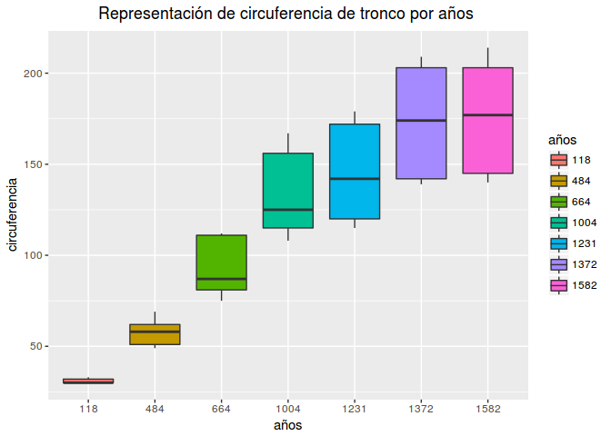

Taller nivel medio
================
Cristina HG(@\_musicalnote)
19-mayo-2017

Bienvenidos al taller nivel medio de R. En él aprenderás a hacer más eficiente tu código con alternativas a los bucles, como son **apply**, **sapply**, **lapply**. También aprenderás a paralelizar tu código R, usando más de un núcleo, y por último aprenderás con un ejemplo distintas formas de particionar un dataset y a hacer algunas de las representaciones gráficas más comunes, como boxplots, nube de puntos o hibstogramas. ¡Empezamos!

Parte 1: Agilizando el código - programación funcional
======================================================

Una práctica muy recomendable en R es evitar los bucles, sobre todo los **for**. Incluso hay quien prohíbe su uso totalmente... la razón principal es la eficiencia. ¿Pero tanto se nota? Bueno... eso júzgalo tú a continuación. En el siguiente código vamos a crear un conjunto de datos. Para ello símplemente vamos a ir generando los datos mediante una distribución normal aleatoria con **rnorm**, especificando el número de observaciones que queremos crear, la media y la desviación típica de las mismas. Lo hacemos dentro de un for, y creamos el conjunto de datos con 10000 filas y 200 columnas:

``` r
# Creamos el conjunto de datos con un bucle for

dataset<-NULL

for(i in 1:200){
    dataset<-cbind(dataset,rnorm(10000,i,1))
}
# convertimos a data frame
dataset<-as.data.frame(dataset)
# renombramos las columnas
colnames(dataset)<-paste("c",1:200,sep = "")
# mostramos dos líneas de las 10 primeras columnas del conjunto creado
head(dataset[,1:10],2)
```

    ##           c1       c2       c3       c4       c5       c6       c7
    ## 1 -0.6769623 2.811364 1.736721 3.833331 6.128680 7.547859 7.644851
    ## 2 -0.3192227 3.245700 4.060395 2.562024 3.147551 5.437098 6.310884
    ##         c8       c9       c10
    ## 1 9.379159 7.973049 10.337487
    ## 2 8.902316 8.717597  8.727484

Te habrás percatado de que tarda unos segundos. Ahora hacemos lo mismo funcional:

``` r
# lo hacemos funcional
dataset<-NULL

dataset <-lapply(1:200, function(i) rnorm(10000,i,1) )
# convertimos a data frame
dataset<-as.data.frame(dataset)
# renombramos las columnas
colnames(dataset)<-paste("c",1:200,sep = "")
head(dataset[,1:10],2)
```

    ##          c1       c2       c3       c4       c5       c6       c7       c8
    ## 1 0.8627921 2.541734 4.301893 1.478179 4.829547 5.598995 7.465207 6.877102
    ## 2 1.7489964 0.739605 4.830726 3.021924 4.818849 6.186154 6.597888 6.920381
    ##         c9      c10
    ## 1 8.236283 9.589537
    ## 2 9.177134 9.767528

¿Has notado la diferencia? Aunque en este caso la diferencia de tiempo no es muy grande (~3s), es sólo un ejemplo muy simple para ilustrar. Cuando trabajamos con datasets más grandes u operaciones más complejas la diferencia puede llegar a ser de horas.

#### Ejercicio 1:

**Puedes comprobar como la diferencia de tiempo aumenta repitiendo lo anterior creando un dataset más grande.**

Apply, lapply y sapply
----------------------

**Funcional** debe su nombre a que recibe una función como parámetro, así que tanto apply, como sapply y lapply recibirán una función entre sus parámetros.

### Apply

Cuando tenemos un conjunto de datos sobre el que queremos hacer alguna operación por filas o columnas, podemos usar **apply(datos, 1|2, función)**, donde ***datos*** son los datos sobre los que queremos operar, ***1*** es un flag para indicar si queremos operar por filas o ***2*** si queremos operar por columnas, y ***función*** es la función que queremos aplicar a cada fila o columna de los datos proporcionados. Es importante que los datos sean del mismo tipo para poder realizar las mismas operaciones sobre ellos.

Por ejemplo, podemos usar **apply** para calcular la media de cada columna de nuestro gran dataset:

``` r
col.means<-apply(dataset,2,mean)
# mostramos sólo las 30 últimas líneas por simplificar la salida
tail(col.means,30)
```

    ##     c171     c172     c173     c174     c175     c176     c177     c178 
    ## 170.9956 172.0106 173.0080 173.9978 175.0166 176.0134 177.0155 178.0089 
    ##     c179     c180     c181     c182     c183     c184     c185     c186 
    ## 178.9810 179.9837 180.9795 181.9962 182.9822 183.9878 185.0043 186.0047 
    ##     c187     c188     c189     c190     c191     c192     c193     c194 
    ## 186.9910 187.9947 189.0034 190.0035 191.0074 192.0018 192.9923 194.0143 
    ##     c195     c196     c197     c198     c199     c200 
    ## 194.9930 195.9905 197.0044 197.9878 198.9931 200.0054

#### Ejercicio 2:

**Usa Apply para calcular el coeficiente de variación (desviación típica dividido por la media) de cada columna de nuestro conjunto de datos.**

### Lapply

Esta función recibe unos datos, que suelen ser una lista o un vector, y una función como parámetros. Su funcionamiento consiste en recorrer los datos especificados y aplicarles la función especificada. Es como una versión de Apply que devuelve el resultado en forma de lista, por eso la **L**.

Por ejemplo, podemos usar **lapply** para calcular cuántos números negativos hay en cada columna de nuestro dataset:

``` r
negatives.count<-lapply(1:ncol(dataset), function(i){
  length(which(dataset[[i]]<0))
})

# mostramos sólo un trozo del output por simplicidad
head(negatives.count,4)
```

    ## [[1]]
    ## [1] 1559
    ## 
    ## [[2]]
    ## [1] 207
    ## 
    ## [[3]]
    ## [1] 12
    ## 
    ## [[4]]
    ## [1] 0

Como veis, nos devuelve el resultado en una lista. Si quisiéramos el resultado en forma de vector en vez de lista, podemos usar **unlist** sobre la salida de **lapply**.

### Sapply

La sintaxis es la misma que la de **lapply**, cambiando el nombre de la función. La dinámica también es la misma, pero **sapply** devuelve como resultado un vector en lugar de una lista.

Por ejemplo, podemos repetir el código anterior usando **sapply**, y veremos que sólo difiere en el formato que presenta la salida:

``` r
negatives.count<-sapply(1:ncol(dataset), function(i){
  length(which(dataset[[i]]<0))
})

# mostramos la salida
negatives.count
```

    ##   [1] 1559  207   12    0    0    0    0    0    0    0    0    0    0    0
    ##  [15]    0    0    0    0    0    0    0    0    0    0    0    0    0    0
    ##  [29]    0    0    0    0    0    0    0    0    0    0    0    0    0    0
    ##  [43]    0    0    0    0    0    0    0    0    0    0    0    0    0    0
    ##  [57]    0    0    0    0    0    0    0    0    0    0    0    0    0    0
    ##  [71]    0    0    0    0    0    0    0    0    0    0    0    0    0    0
    ##  [85]    0    0    0    0    0    0    0    0    0    0    0    0    0    0
    ##  [99]    0    0    0    0    0    0    0    0    0    0    0    0    0    0
    ## [113]    0    0    0    0    0    0    0    0    0    0    0    0    0    0
    ## [127]    0    0    0    0    0    0    0    0    0    0    0    0    0    0
    ## [141]    0    0    0    0    0    0    0    0    0    0    0    0    0    0
    ## [155]    0    0    0    0    0    0    0    0    0    0    0    0    0    0
    ## [169]    0    0    0    0    0    0    0    0    0    0    0    0    0    0
    ## [183]    0    0    0    0    0    0    0    0    0    0    0    0    0    0
    ## [197]    0    0    0    0

#### Ejercicio 3:

**El ejemplo que hemos hecho con lapply y sapply no es muy reutilizable, ya que estamos asumiendo que existe una variable que se llama *dataset* y que contiene un dataset. ¿Cómo podemos arreglarlo?** **Pista: las funciones pueden recibir más de un sólo parámetro.**

#### Ejercicio 4:

**Usa programación funcional para sustituir por *NAs* todos los números negativos del dataset. Puedes usar *length(which(is.na(dataset\[\[i\]\])))* para comprobar si lo has hecho bien, comprobando que el número de NAs de cada columna coincide con el número de negativos que obtuvimos anteriormente para cada columna.**

Por si quieres saber más: paralelizando en R
--------------------------------------------

Una práctica muy útil en R es el paralelismo. Supongamos que queremos ejecutar una misma función sobre distintos datasets del mismo tamaño. Si los datasets fueran aproximadamente del tamaño del nuestro, o la función fuera costosa en cómputo, podría tardar mucho tiempo en realizar las ejecuciones.
Una opción para acortar ese tiempo es hacerlo en paralelo, es decir, utilizar varios núcleos del ordenador para realizar la tarea, y si has entendido **apply**, **lapply** y **sapply** es muy directo. Las tres funciones explicadas arriba, tienen una versión paralela: **parApply**, **parLapply** y **parSapply** incluidas en el paquete **parallel**. Para usarlas, sólo hay que tener en cuenta que es necesario crear un cluster con tantos cores como deseemos utilizar, con la función **makeCluster()** y pasarle el cluster a la función **parApply** que deseemos utilizar, además de los parámetros que ya le pasábamos anteriormente. Por último, una buena práctica es detener el cluster creado cuando ya no lo necesitamos con **stopCluster()**.

Por ejemplo, se puede paralelizar la generación de 25 soluciones binarias aleatorias y su optimización a través de un algoritmo de búsqueda local:

``` r
# cargamos librería
  library(parallel)
# obtenemos nuestro número de cores
  no_cores <- detectCores()
# creamos el cluster  
  cl <- makeCluster(no_cores-1,type="FORK")
# utilizamos parLapply , pasándole el cluster  
  ModelosBL <- parLapply(cl,seq_along(1:25),  function(i){
    set.seed(12345*i)
    # genera una solución vecina aleatoria
    vecina<-sample(0:1,350,replace=TRUE)
    # optimizar con búsqueda local
    modelo<-LocalSearchModified(vecina)
    modelo
  }) 
# detenemos el cluster  
stopCluster(cl)
```

(No se incluye el código del algoritmo de Búsqueda local).

#### Ejercicio 5 (Opcional):

**Crea otro dataset como el que creamos al comienzo del taller, con distinto nombre. Luego crea una lista con ambos datasets usando la función *list* , y paraleliza el código para aplicar sobre cada dataset una función que eleva cada valor al cuadrado. ¡Verás qué rápido lo hace a pesar del tamaño de los datasets!** **Nota: Es conveniente que crees el cluster con tu número de cores -1.**

El paquete **parallel** incluye otras funciones que puedes consultar en [documentación paquete parallel](https://stat.ethz.ch/R-manual/R-devel/library/parallel/doc/parallel.pdf "paquete parallel").

Parte 2: Visualización y particionado de datos
==============================================

Una buena práctica cada vez que tenemos delante un conjunto de datos es explorar su contenido, echando un vistazo a la estructura de las variables, los rangos en los que se mueven, de qué tipo son... Esto nos da una idea de ante qué problema estamos, y como podemos abordarlo. Para hacer el análisis exploratorio de los datos, podemos usar funciones como **class** para ver la clase de los objetos, **str** para ver información sobre la estructura de los datos o **summary** para ver un resumen del dataset. También es común hacer una representación visual como una nube de puntos, para ver visualmente cómo se distribuyen los datos, y boxplots o hibstogramas para visualizar los rangos en los que toman valores las variables. Veamos un ejemplo:

Con rstudio tenemos incluidos varios datasets que vienen incluidos en el paquete *datasets*. Para ver una lista completa de los datasets incluidos:

``` r
data()
```

Vamos a hacer un análisis exploratorio del dataset **Orange**, que incluye datos sobre el crecimiento de 5 naranjos, concretamente la edad del árbol y el grosor de su tronco, cuando se le realizó la medición.

``` r
# Información sobre estructura
str(Orange)
```

    ## Classes 'nfnGroupedData', 'nfGroupedData', 'groupedData' and 'data.frame':   35 obs. of  3 variables:
    ##  $ Tree         : Ord.factor w/ 5 levels "3"<"1"<"5"<"2"<..: 2 2 2 2 2 2 2 4 4 4 ...
    ##  $ age          : num  118 484 664 1004 1231 ...
    ##  $ circumference: num  30 58 87 115 120 142 145 33 69 111 ...
    ##  - attr(*, "formula")=Class 'formula'  language circumference ~ age | Tree
    ##   .. ..- attr(*, ".Environment")=<environment: R_EmptyEnv> 
    ##  - attr(*, "labels")=List of 2
    ##   ..$ x: chr "Time since December 31, 1968"
    ##   ..$ y: chr "Trunk circumference"
    ##  - attr(*, "units")=List of 2
    ##   ..$ x: chr "(days)"
    ##   ..$ y: chr "(mm)"

``` r
# Resumen del dataset
summary(Orange)
```

    ##  Tree       age         circumference  
    ##  3:7   Min.   : 118.0   Min.   : 30.0  
    ##  1:7   1st Qu.: 484.0   1st Qu.: 65.5  
    ##  5:7   Median :1004.0   Median :115.0  
    ##  2:7   Mean   : 922.1   Mean   :115.9  
    ##  4:7   3rd Qu.:1372.0   3rd Qu.:161.5  
    ##        Max.   :1582.0   Max.   :214.0

Con **str** vemos que el dataset está compuesto por 35 filas y 3 columnas, y que una de sus columnas son factores, mientras que las otras dos son numéricas. Con **summary** obtenemos un resumen del dataset, como cual es el mínimo, máximo, media, mediana... de cada columna. Nota: En la columna *Tree* solo se muestra el número de muestras de casa clase porque los datos no son numéricos).

### Nube de puntos

Podemos hacer una primera exploración visual de los datos pintando los datos con la función **qplot** de **ggplot2**. Si no la tenemos instalada, la instalamos con `install.packages('ggplot2')`.

``` r
library(ggplot2)
qplot(age, circumference, data = Orange, geom = "point",xlab = "años", ylab="circuferencia del tronco", colour=Tree, main="Crecimiento de los árboles de naranja")+theme(plot.title = element_text(hjust = 0.5))+scale_color_discrete(name="Árbol")
```


**qplot** es una forma rápida y sencilla de hacer gráficos completos. Le indicamos los datos que queremos representar, qué geometría deseamos ( *geom* ) y qué deseamos poner en los ejes. Con `colour=Tree`, indicamos que nos coloree los datos en función de la clase a la que pertenezca, con los colores por defecto. Si quisiéramos darle unos colores personalizados, podríamos hacerlo añadiendo una nueva capa con **scale\_color\_manual**, lo que nos permitirá cambiar los colores manualmente. Por ejemplo, añadiendo: `scale_color_manual(values = c("#ff0000","#ff4000","#ff8000","#ffbf00","#ffff00")` cambiaríamos los colores por defecto por unos tonos cálidos. Usando el atributo *name* en **scale\_color\_discrete**, ponemos cambiar el título por defecto que le damos a la leyenda. Ésto también podemos hacerlo con **scale\_color\_manual** siempre y cuando especifiquemos también un conjunto de valores. Por último, podemos añadirle un título a nuestro gráfico usando el parámetro **main** o con **ggtitle()**, y podemos guardar la imágen directamente con *ggsave()*.

En cuanto a los datos, podemos observar que parece que la tendencia para los 5 árboles es que va aumentando el tamaño de la circuferencia de su tronco conforme van pasando los años. Sí, parece que eso de "a más años tienen más grande el tronco" es cierto.

### Boxplots (o diagramas de cajas y bigotes)

Otra visualización muy típica y útil son los Boxplots. Con ellos se representa visualmente cómo se distribuyen los valores que toma una variable en una cajita. La cajita se divide en tres cuartiles. El segundo cuartil, que se representa con la raya horizontal negra, es la mediana de esos datos. Las rayas verticales que atraviesan la cajita representan valores poco comunes. Concretamente, la raya de abajo representa todos los valores que están entre el primer cuartil y el mínimo valor que no es un outlier, mientras que la de arriba representa valores entre el tercer cuartil y el máximo valor que no es un outlier.

Por ejemplo, podemos usar boxplots para representar unas variables frente a otras y obtener conclusiones:

``` r
# obtenemos las columnas de años y circuferencia
d<-subset(Orange[,-1])
# lo pasamos a data frame para que ggplot lo sepa manejar
d<-as.data.frame(d)
# creamos el gráfico
ggplot(d,aes(x=factor(age),y=circumference,fill=factor(age)))+geom_boxplot()+xlab("años")+ylab("circuferencia")+scale_fill_discrete(name="años")+ggtitle("Representación de circuferencia de tronco por años ")+theme(plot.title = element_text(hjust = 0.5))
```



Donde **d** son los datos que queremos representar (edad y circuferencia), con **fill** indicamos que nos coloree los boxplots con tantos colores por defecto como años hay, con **geom\_boxplot()** indicamos que queremos la geometría de boxplots, y usamos **xlab** e **ylab** para cambiar los nombres de los ejes. Por último, cambiamos el nombre de la legenda con **scale\_fill\_discrete** como ya sabemos, y añadimos un título, que posicionamos.

Con el código anterior, representamos la circuferencia del árbol por años. De nuevo podemos observar que a más años tienen los árboles, mayor diámetro del tronco presentan. También podemos obervar que hay un rango de años \[1004-1582\] donde es difícil distinguir la edad esacta que tiene el árbol en función de la circuferencia, y viceversa, pues muchos valores se solapan.

### Histogramas
